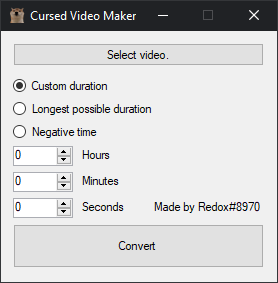
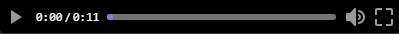
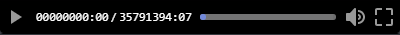
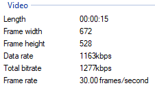

# CursedVideoMaker
CVM Can be used to create "cursed" video's which are hex edited MP4's.

Mainly made for discord video's but can be used on any program or website that reads the video header.

GUI:

## Download
- **[Latest release](https://github.com/wrefgtzweve/CursedVideoMaker/releases/latest)**
## Examples
Discord examples:

Original:

Custom duration set to 20 seconds:

Longest duration:

Negative duration:

#### Windows file properties:

Input video:

Output video (longest duration):

###### Note: The video lenght stays the same and the file size doesn't change.
